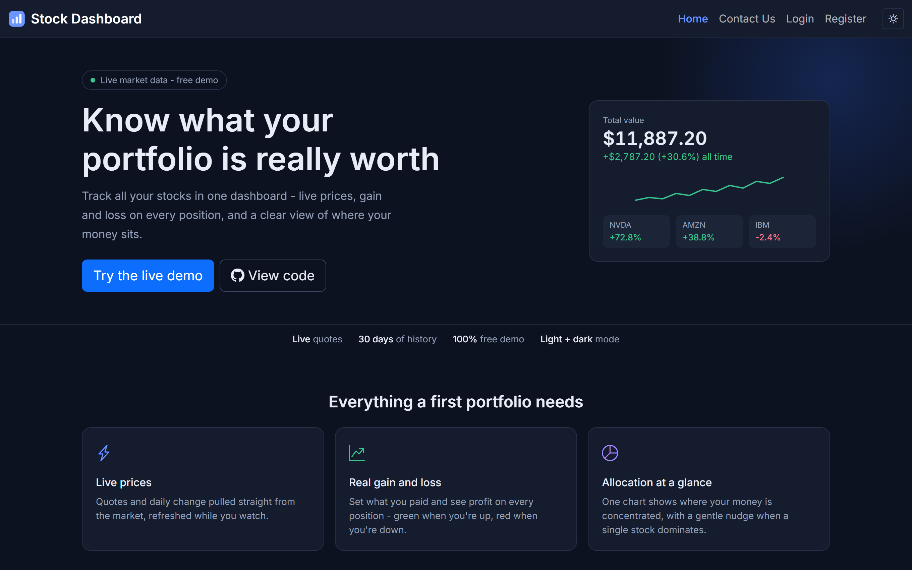
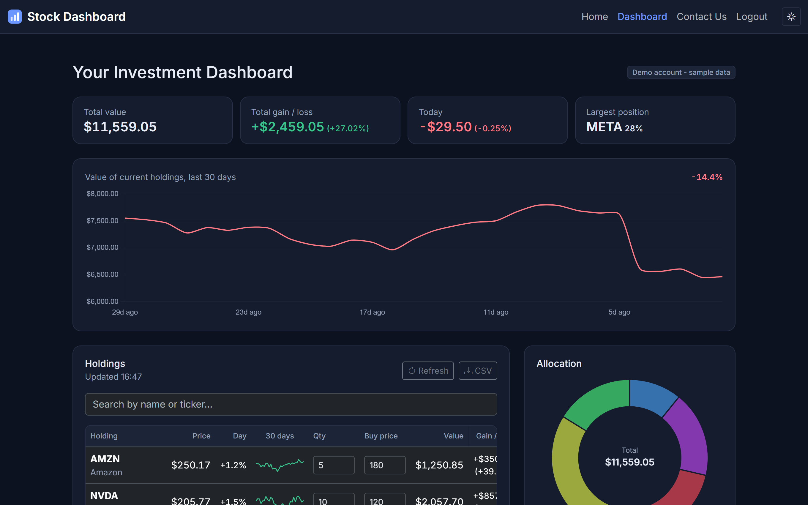

# Stock Dashboard

A web app I built to answer one question I actually had as a beginner investor: is my portfolio
making money or not? You add the stocks you own, set what you paid, and the dashboard shows live
prices, profit and loss on every position, and how your money is split between companies.

**Live demo:** https://badvilgo.github.io/investing-portfolio-2/

> Demo login: `test@test.com` / `test.com` - no signup needed, sample portfolio included.

## Screenshots





## What it does

- Shows the total value of your portfolio, total gain / loss, and today's change at a glance
- Tracks profit per holding against the price you paid, in dollars and percent
- Draws a 30-day history of your portfolio value and a small price trend for every stock
- Warns you (informationally, not as advice) when too much of your money sits in one company
- Lets you search any stock by ticker or name and add it in one click
- Saves your portfolio to your account, so it follows you between devices
- Works in light and dark mode, on desktop and mobile
- Exports your holdings to CSV

## Tech stack

React 18, TypeScript, Vite, React Router, Supabase (auth + PostgreSQL), Twelve Data API,
Chart.js, Bootstrap 5, Vitest + Testing Library.

## How it's organised

```
src/
  components/      Navbar, ProtectedRoute, Toast, theme toggle, dashboard widgets
  hooks/           useAuth, useDebounce, useTheme, useCountUp, usePageMeta
  lib/             API clients, portfolio calculations (with unit tests), theme store
  pages/           Home, Login, Register, Dashboard, ContactUs
  types/           Shared TypeScript interfaces
supabase/          Database schema with Row Level Security policies
```

The rule I tried to follow: components render, hooks manage state, and everything that can be a
pure function (percentage math, history building, CSV export) lives in `lib/` where it is easy
to unit test.

## Problems I ran into (and how I solved them)

**Free API rate limits.** Twelve Data's free tier allows 8 requests per minute, and I need one
time-series request per stock for the sparklines. So daily price history is cached in local
storage for 24 hours, series are fetched sequentially with a per-load cap, and automatic
refreshes are throttled. The app degrades gracefully - if the limit hits, it shows the last
known prices with a notice instead of breaking.

**Refreshing on a subpage returned a 404.** GitHub Pages only serves static files, so a direct
visit to `/dashboard` had no file to serve. Fixed with the standard `404.html` redirect trick:
the 404 page encodes the path into a query string, and a small script in `index.html` restores
it before React Router starts.

**Bootstrap kept overriding my styles.** My page CSS ended up in the bundle before Bootstrap
because of import order in the component tree, so equal-specificity rules lost. Moving the
Bootstrap imports to `main.tsx` (so they always load first) fixed a whole class of styling bugs.

**Legacy data without new fields.** Adding the buy price feature meant old saved portfolios had
no `avgCost`. A normalisation step on load fills missing fields with sensible defaults, so
nothing breaks and no database migration was needed.

## Running it locally

```
npm install
```

Copy `.env.example` to `.env` and fill in your keys (all three services have free tiers):

```
VITE_SUPABASE_URL=your-supabase-project-url
VITE_SUPABASE_ANON_KEY=your-supabase-anon-key
VITE_TWELVE_DATA_API_KEY=your-twelve-data-api-key
```

For your own Supabase project, run `supabase/schema.sql` in the Supabase SQL editor - it creates
the `portfolios` table and the Row Level Security policies that keep each user's data private.

```
npm run dev
```

Other scripts: `npm test` (unit tests), `npm run build` (type-check + production build),
`npm run preview` (serve the build locally), `npm run deploy` (publish to GitHub Pages).

## Accessibility and SEO

- Semantic landmarks, a skip-to-content link, labelled form controls and icon buttons
- Charts and sparklines carry text alternatives for screen readers
- Live regions announce search results, loading states and notifications
- All animations respect the `prefers-reduced-motion` setting
- Per-page titles, meta description, Open Graph / Twitter tags, JSON-LD, sitemap and robots.txt

## Honest notes

- The Supabase anon key is a public client-side key by design - data access is enforced by Row
  Level Security on the server, not by hiding the key.
- Market data can lag or be briefly unavailable on the free API tier. The UI says so instead of
  pretending otherwise.
- The concentration indicator is informational only. The app deliberately gives no investment
  advice.

## What I'd add next

- Sorting and filtering in the holdings table
- Portfolio history stored server-side, so the chart survives cache resets
- Moving API calls behind a small serverless proxy so the market data key is not in the bundle
- End-to-end tests for the main user flow

## What I learned

Migrating a Create React App project to Vite and TypeScript, designing around API rate limits,
theming with CSS design tokens, Row Level Security in Postgres, hand-drawing SVG charts, and the
difference between code that works and code I can test.
